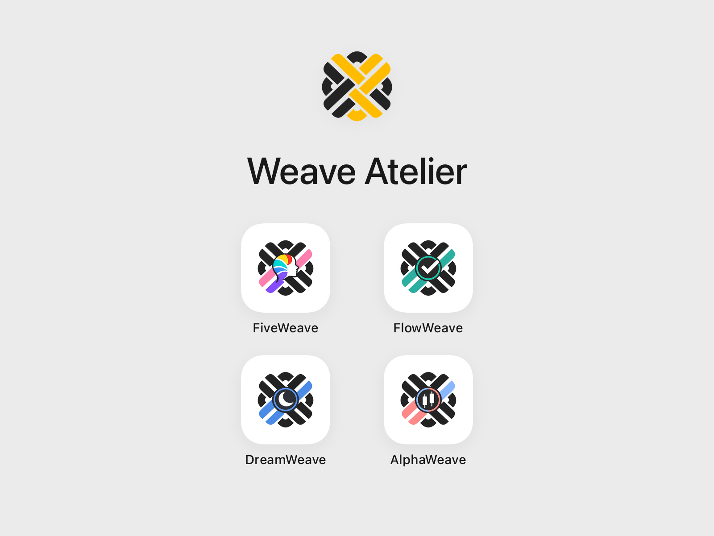
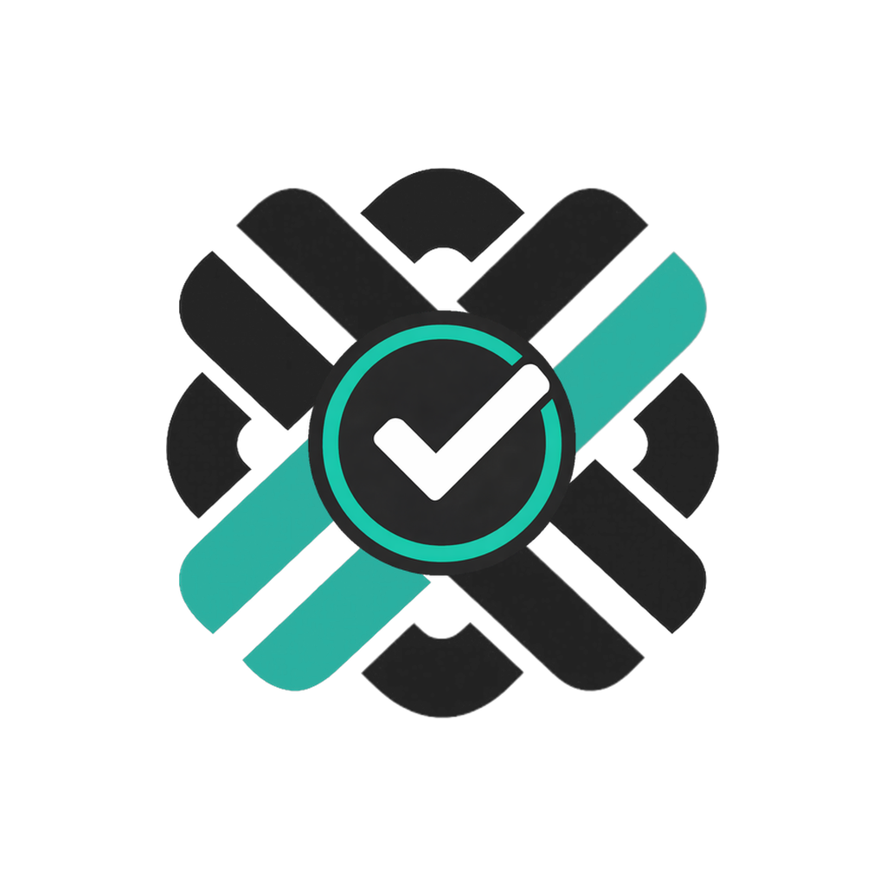
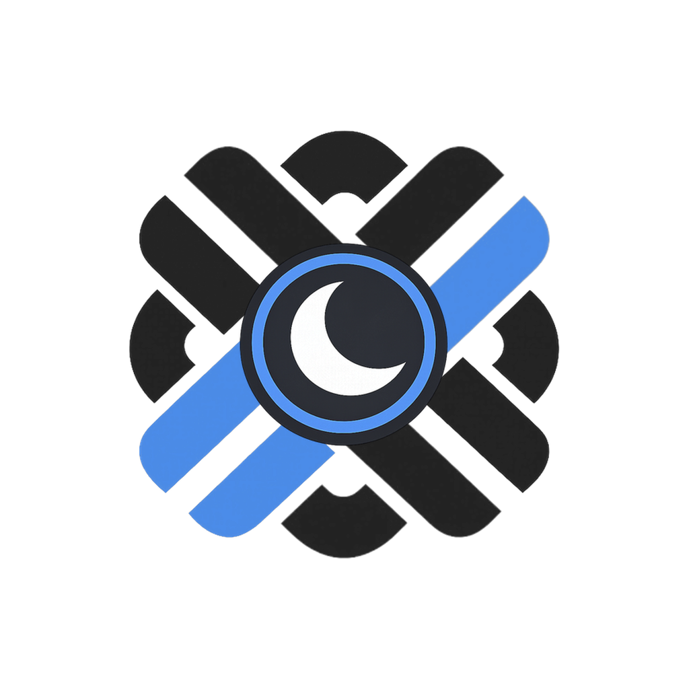
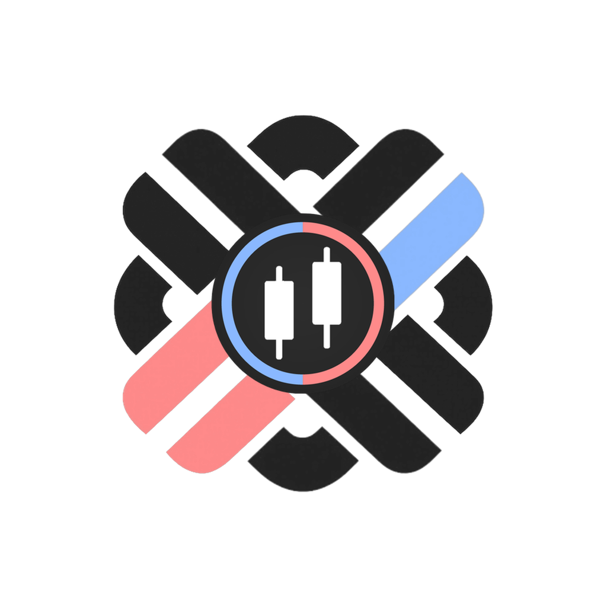

# Weave Atelier

[Read this README in Korean](./README_KR.md)

**Weave Atelier is an independent software studio building apps for personality, work, sleep, and markets.**

## Philosophy

The name **Weave** reflects what our products do: they weave scattered data, context, and signals into clearer, calmer, and more understandable forms.

Complex systems become easier to work with when signals are clearer and structure is easier to read. Weave Atelier builds a portfolio of apps with a shared design language across different domains rather than forcing everything into a single monolithic platform.

Each product addresses a different kind of complexity, but the direction is similar: reduce fragmentation, surface meaningful structure, and help people understand what they are working with more clearly.

## Products

### [FiveWeave](https://github.com/weaveatelier/fiveweave)

**A personality app for deeper self-understanding and mutual understanding through the BIG5 model.**

FiveWeave is designed to help people understand personality more clearly than simple type labels allow. It brings a calmer, more structured view of personality through the BIG5 model, with an emphasis on deeper self-understanding and better mutual understanding.

### [FlowWeave](https://github.com/weaveatelier/flowweave)

**A productivity app for clearer flow and deeper focus across tasks and context.**

FlowWeave is built to reduce fragmentation across tasks, schedules, and surrounding context. Its goal is to turn complex work into clearer flow, so people can see what matters, move through work more intentionally, and focus more deeply on meaningful execution.

### [DreamWeave](https://github.com/weaveatelier/dreamweave)

**A sleep data app for clearer night-by-night understanding across connected devices.**

DreamWeave brings sleep-related data together across connected devices and turns it into a calmer, more readable view of each night. It is designed to reduce interpretation burden and help people understand what happened during sleep more clearly over time.

### [AlphaWeave](https://github.com/weaveatelier/alphaweave)

**A cross-asset market intelligence app for clearer signals, regimes, and shifts.**

AlphaWeave is designed to make market conditions easier to read across signals, regimes, and meaningful changes over time. It aims to support a more structured and research-oriented view of markets without collapsing into noise, hype, or overconfident calls.

## Direction

Weave Atelier is currently being built as an independent studio, with each product developed iteratively and with strong attention to foundations.

The broader direction is straightforward: build software that makes complex systems easier to read, easier to navigate, and easier to work with.
